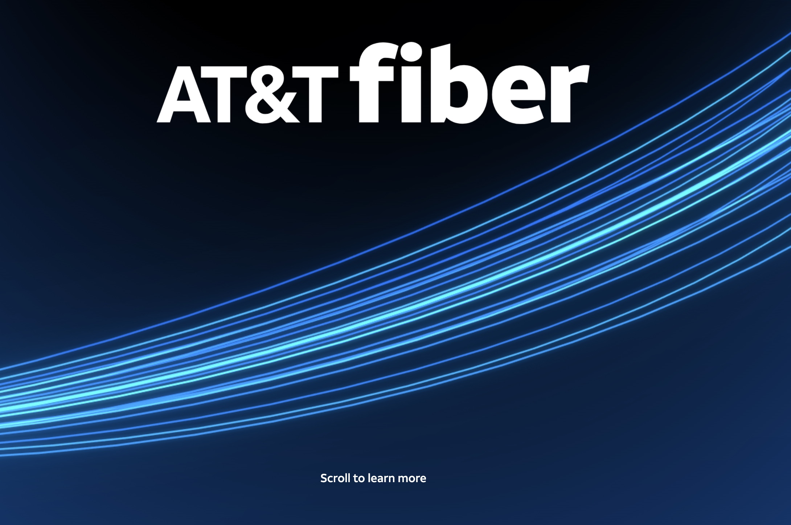

Tasked with creating a novel and "Wow Factor" experience for a new AT&T Fiber retail display, my team began trading concepts. We settled on a concept involving storytelling through the lens of Fiber cables. I was tasked with prototyping a series of animations to bring the experience to life. 

The sleek Fiber Cable animations were a departure from typical brand presentation and were received with high regard by the client! 

